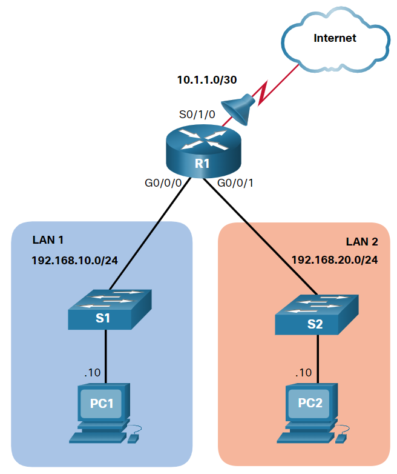

# Access List Control - Conceitos e exemplos

    Ao configurar uma ACL complexa, sugere-se que você:
    Use um editor de texto e escreva as especificidades da política a ser implementada.
    Adicione os comandos de configuração do IOS para realizar essas tarefas.
    Incluir observações para documentar a ACL.
    Copie e cole os comandos no dispositivo.
    Sempre teste minuciosamente uma ACL para garantir que ela aplica corretamente a política desejada.

    # Sintaxe numerada da ACL IPv4 padrão
        Router(config)# access-list access-list-number {deny | permit | remark text} source [source-wildcard] [log]

            Parâmetro	                    Descrição
            access-list-number.............Este é o número decimal da ACL. O intervalo de números ACL padrão é de 1 a 99 ou 1300 a 1999.
            deny...........................Nega o acesso se as condições corresponderem.
            permit.........................Permite o acesso se as condições corresponderem.
            remark text....................(Opcional) Isso adiciona uma entrada de texto para fins de documentação. Cada observação é limitada a 100 caracteres.
            source.........................Isso identifica a rede de origem ou o endereço do host a ser filtrado.
                                           Use a palavra-chave any para especificar todas as redes.
                                           Use a palavra-chave host ip address ou simplesmente digite um endereço IP (sem o host ) para identificar um endereço IP específico.
            source-wildcard................(Opcional) Máscara curinga de 32 bits a ser aplicada à origem. . Se omitido, uma máscara padrão 0.0.0.0 é assumida.
            log............................(Opcional) Esta palavra-chave gera e envia uma mensagem informativa sempre que a ACE for correspondida.
                                            A mensagem inclui número ACL, condição correspondente (isto é, permitido ou negado), endereço de origem e número de pacotes.
                                            Esta mensagem é gerada para o primeiro pacote correspondente.
                                            Esta palavra-chave só deve ser implementada para resolução de problemas ou motivos de segurança.
                        
    
    # Sintaxe nomeada da ACL IPv4 padrão
        Router(config)# ip access-list standard access-list-name

        Observação: Use o comando no ip access-list standard access-list-name global configuration para remover uma ACL IPv4 padrão nomeada.

    
    # Aplicar uma ACL IPv4 padrão
        Depois que uma ACL IPv4 padrão é configurada, ela deve ser vinculada a uma interface ou recurso. O comando a seguir pode ser usado para vincular uma ACL IPv4 padrão numerada ou nomeada a uma interface:

            Router(config-if) # ip access-group {access-list-number | access-list-name} {in | out}

            Obs.: Para remover uma ACL de uma interface, primeiro digite o comando no ip access-group interface configuration. No entanto, a ACL ainda será configurada no roteador.  
                  Para remover a ACL do roteador, use o comando de configuração no access-list global.

                  

             Suponha que apenas PC1 é permitido sair para a internet. Para habilitar essa diretiva, uma ACL ACE padrão pode ser aplicada de saída em S0/1/0, conforme mostrado na figura.
                
                R1(config)# access-list 10 remark ACE permits ONLY host 192.168.10.10 to the internet
                R1(config)# access-list 10 permit host 192.168.10.10
                R1(config)# do show access-lists
                    Standard IP access list 10
                        10 permit 192.168.10.10
                R1(config)#

                Observe que a saída do show access-lists comando não exibe as remark instruções. As observações da ACL são exibidas no arquivo de configuração em execução. Embora o remark comando não seja necessário para habilitar a ACL, ele é fortemente sugerido para fins de documentação.

             Agora suponha que uma nova diretiva de rede afirma que os hosts na LAN 2 também devem ter permissão para a Internet. Para habilitar essa diretiva, uma segunda ACL ACE padrão pode ser adicionada à ACL 10, conforme mostrado na saída.

                R1(config)# access-list 10 remark ACE permits all host in LAN 2
                R1(config)# access-list 10 permit 192.168.20.0 0.0.0.255
                R1(config)# do show access-lists
                Standard IP access list 10
                    10 permit 192.168.10.10
                    20 permit 192.168.20.0, wildcard bits 0.0.0.255
                R1(config)#   

             Aplique a saída da ACL 10 na interface Serial 0/1/0.
                R1(config)# interface Serial 0/1/0
                R1(config-if)# ip access-group 10 out
                R1(config-if)# end
                R1#   

             A política resultante da ACL 10 só permitirá que o host 192.168.10.10 e todos os hosts da LAN 2 saiam da interface Serial 0/1/0. Todos os outros hosts na rede 192.168.10.0 não serão permitidos na Internet.

             Use o show running-config comando para revisar a ACL na configuração, conforme mostrado na saída.

                R1# show run | section access-list
                access-list 10 remark ACE permits host 192.168.10.10
                access-list 10 permit 192.168.10.10
                access-list 10 remark ACE permits all host in LAN 2
                access-list 10 permit 192.168.20.0 0.0.0.255
                R1#

             Finalmente, use o show ip interface comando para verificar se uma interface tem uma ACL aplicada a ela. Na saída de exemplo, a saída está especificamente olhando para a interface Serial 0/1/0 para linhas que incluem texto de “lista de acesso”.

                R1# show ip int Serial 0/1/0 | include access list
                Outgoing Common access list is not set
                Outgoing access list is 10
                Inbound Common access list is not set
                Inbound  access list is not set
                R1#    

     
    # Exemplo de ACL IPv4 padrão nomeado

              Suponha que apenas PC1 é permitido sair para a internet. Para habilitar essa diretiva, uma ACL padrão nomeada chamada Permit-ACCESS poderia ser aplicada de saída em S0/1/0.

                Remova a ACL 10 configurada anteriormente e crie uma ACL padrão nomeada chamada Permit-ACCESS, conforme mostrado aqui.

                R1(config)# no access-list 10
                R1(config)# ip access-list standard PERMIT-ACCESS
                R1(config-std-nacl)# remark ACE permits host 192.168.10.10
                R1(config-std-nacl)# permit host 192.168.10.10
                R1(config-std-nacl)#

    
             Agora adicione uma ACE permitindo apenas host 192.168.10.10 e outra ACE permitindo todos os hosts LAN 2 para a internet.

                R1(config-std-nacl)# remark ACE permits host 192.168.10.10
                R1(config-std-nacl)# permit host 192.168.10.10
                R1(config-std-nacl)# remark ACE permits all hosts in LAN 2
                R1(config-std-nacl)# permit 192.168.20.0 0.0.0.255
                R1(config-std-nacl)# exit
                R1(config)#

            Aplique a nova saída ACL nomeada à interface Serial 0/1/0.

                R1(config)# interface Serial 0/1/0
                R1(config-if)# ip access-group PERMIT-ACCESS out
                R1(config-if)# end
                R1#

            
            Use o show access-lists comando show running-config e para revisar a ACL na configuração, conforme mostrado na saída.

                R1# show access-lists
                Standard IP access list PERMIT-ACCESS
                    10 permit 192.168.10.10
                    20 permit 192.168.20.0, wildcard bits 0.0.0.255
                R1# show run | section ip access-list
                ip access-list standard PERMIT-ACCESS
                remark ACE permits host 192.168.10.10
                permit 192.168.10.10
                remark ACE permits all hosts in LAN 2
                permit 192.168.20.0 0.0.0.255
                R1#

            Finalmente, use o show ip interface comando para verificar se uma interface tem uma ACL aplicada a ela. Na saída de exemplo, a saída está especificamente olhando para a interface Serial 0/1/0 para linhas que incluem texto de “lista de acesso”.

                R1# show ip int Serial 0/1/0 | include access list
                Outgoing Common access list is not set
                Outgoing access list is PERMIT-ACCESS
                Inbound Common access list is not set
                Inbound  access list is not set
                R1#

        - Exercício
            
            Crie uma ACL numerada que nega o host 192.168.10.10, mas permite que todos os outros hosts na LAN 1. Comece configurando a ACL 20 ACE que nega o host 192.168.10.10 usando a host palavra-chave.

    # Dois métodos para modificar uma ACL
        - Esta seção discutirá dois métodos a serem usados ao modificar uma ACL:

            >> Método do Editor de Texto
            >> Método dos números de sequência
        

        >> Método do Editor de Texto
            R1# show run | section access-list 
            access-list 1 deny 19.168.10.10
            access-list 1 permit 192.168.10.0 0.0.0.255

            Suponha que a ACL 1 foi corrigida. Portanto, a ACL incorreta deve ser excluída e as instruções ACL 1 corrigidas devem ser coladas no modo de configuração global, conforme mostrado na saída.

            R1(config)# no access-list 1
            R1(config)#
            R1(config)# access-list 1 deny 192.168.10.10
            R1(config)# access-list 1 permit 192.168.10.0 0.0.0.255

         
        >> Método dos números de sequência
            Uma ACL ACE também pode ser excluída ou adicionada usando os números de sequência ACL. Os números de sequência são atribuídos automaticamente quando uma ACE é inserida. Estes números estão listados no show access-lists comando. O show running-config comando não exibe números de sequência.
                R1# show access-lists 
                Standard IP access list 1 
                    10 deny 19.168.10.10 
                    20 permit 192.168.10.0, wildcard bits 0.0.0.255
                R1#

            Use o ip access-list standard comando para editar uma ACL.
               R1# conf t
                R1(config)# ip access-list standard 1
                R1(config-std-nacl)# no 10
                R1(config-std-nacl)# 10 deny host 192.168.10.10
                R1(config-std-nacl)# end
                R1# show access-lists
                Standard IP access list 1
                    10 deny   192.168.10.10
                    20 permit 192.168.10.0, wildcard bits 0.0.0.255
                R1#

        >> Modificar um exemplo de ACL nomeado
            As ACLs nomeadas também podem usar números de sequência para excluir e adicionar ACEs. Consulte o exemplo para ACL NO-ACCESS.

            R1# show access-lists
            Standard IP access list NO-ACCESS
                10 deny   192.168.10.10
                20 permit 192.168.10.0, wildcard bits 0.0.0.255
            Suponha que o host 192.168.10.5 da rede 192.168.10.0/24 também deve ter sido negado. Se você inseriu uma nova ACE, ela será anexada ao final da ACL. Portanto, o host nunca seria negado porque o ACE 20 permite todos os hosts dessa rede.

            Observação: A função de hash é aplicada apenas a instruções de host em uma lista de acesso padrão IPv4. Os detalhes da função de hash estão fora do escopo deste curso.

                R1# configure terminal
                R1(config)# ip access-list standard NO-ACCESS
                R1(config-std-nacl)# 15 deny 192.168.10.5
                R1(config-std-nacl)# end
                R1#
                R1# show access-lists
                Standard IP access list NO-ACCESS
                    15 deny   192.168.10.5
                    10 deny   192.168.10.10
                    20 permit 192.168.10.0, wildcard bits 0.0.0.255
                R1#

        # Estatísticas de ACL
            Use o clear access-list counters comando para limpar as estatísticas de ACL. Esse comando pode ser utilizado sozinho ou com o número ou o nome de uma ACL específica.

                R1# show access-lists
                Standard IP access list NO-ACCESS
                    10 deny   192.168.10.10  (20 matches) 
                    20 permit 192.168.10.0, wildcard bits 0.0.0.255  (64 matches) 
                R1# clear access-list counters NO-ACCESS
                R1# show access-lists
                Standard IP access list NO-ACCESS
                    10 deny   192.168.10.10
                    20 permit 192.168.10.0, wildcard bits 0.0.0.255
                R1#

        # MODIFICANDO ACL
        
            Adicione duas linhas adicionais no final da ACL. No modo de configuração global, modifique ACL, BRANCH-OFFICE-POLICY.

                R1#(config)# ip access-list standard BRANCH-OFFICE-POLICY
                R1(config-std-nacl)# 30 permit 209.165.200.224 0.0.0.31
                R1(config-std-nacl)# 40 deny any
                R1(config-std-nacl)# end

        

        # Proteger portas VTY com uma ACL IPv4 padrão

                O comando access-class

                    Use as duas etapas a seguir para proteger o acesso administrativo remoto às linhas vty:

                    - Crie uma ACL para identificar quais hosts administrativos devem ter acesso remoto.
                    - Aplique a ACL ao tráfego de entrada nas linhas vty.

                    Sintaxe:
                        R1(config-line)# access-class {access-list-number | access-list-name} { in | out } 

            
        

                Para aumentar o acesso seguro, um nome de usuário e senha serão criados, e o método de login local autenticação será usado nas linhas vty. O comando no exemplo cria uma entrada de banco de dados local para um usuário ADMIN e senha class.

                Uma ACL padrão nomeada chamada ADMIN-HOST é criada e identifica PC1. Observe que o deny any foi configurado para rastrear o número de vezes que o acesso foi negado.

                As linhas vty são configuradas para usar o banco de dados local para autenticação, permitir tráfego Telnet e usar a ACL ADMIN-HOST para restringir o tráfego.

                    R1(config)# username ADMIN secret class
                    R1(config)# ip access-list standard ADMIN-HOST
                    R1(config-std-nacl)# remark This ACL secures incoming vty lines
                    R1(config-std-nacl)# permit 192.168.10.10
                    R1(config-std-nacl)# deny any
                    R1(config-std-nacl)# exit
                    R1(config)# line vty 0 4
                    R1(config-line)# login local
                    R1(config-line)# transport input telnet
                    R1(config-line)# access-class ADMIN-HOST in
                    R1(config-line)# end
                    R1#

        # Configurar ACLs IPv4 estendidas
            As ACLs estendidas são utilizadas com mais frequência do que as ACLs padrão porque proporcionam maior controle. Eles podem filtrar no endereço de origem, endereço de destino, protocolo (ou seja, IP, TCP, UDP, ICMP) e número da porta.

            Como ACLs padrão, ACLs estendidas podem ser criadas como:

                ACL estendida numerada - criada usando o comando de configuração global access-list access-list-number.
                ACL estendida nomeada - criada usando o nome da ip access-list extended access-list-name

                Sintaxe numerada da ACL IPv4 padrão
                    Router(config)# access-list access-list-number {deny | permit | remark text} protocol source source-wildcard [operator {port}] destination destination-wildcard [operator {port}] [established] [log]

            
            Use o comando no ip access-list extended access-list-name (global configuration) para remover uma ACL estendida.

            O comando para aplicar uma ACL IPv4 estendida a uma interface é o mesmo que o comando usado para ACLs IPv4 padrão.

                Router(config-if)# ip access-group {access-list-number | access-list-name} {in | out}

            Para remover uma ACL de uma interface, primeiro digite o comando no ip access-group interface configuration. Para remover a ACL do roteador, use o comando de configuração no access-list global.

            Observação: A lógica interna aplicada à solicitação das instruções da ACL padrão não se aplica às ACLs estendidas. A ordem em que as instruções são fornecidas durante a configuração é ordem em que são exibidas e processadas.

            

            Exemplos de configuração de protocolos e números de porta
                As ACLs estendidas podem filtrar em diferentes opções de número de porta e nome de porta. Este exemplo configura uma ACL 100 estendida para filtrar tráfego HTTP. A primeira ACE usa o nome da www porta. A segunda ACE usa o número da porta 80. Ambos os ACEs atingem exatamente o mesmo resultado.

                R1(config)# access-list 100 permit tcp any any eq www
                R1(config)#  !or...
                R1(config)# access-list 100 permit tcp any any eq 80 
                
                
                A configuração do número da porta é necessária quando não há um nome de protocolo específico listado, como SSH (porta número 22) ou HTTPS (porta número 443), conforme mostrado no exemplo seguinte.

                R1(config)# access-list 100 permit tcp any any eq 22
                R1(config)# access-list 100 permit tcp any any eq 443
                R1(config)#

            # Aplicar uma ACL IPv4 estendida numerada

                Neste exemplo, a ACL permite que o tráfego HTTP e HTTPS da rede 192.168.10.0 vá para qualquer destino.

                    ACLs estendidas podem ser aplicadas em vários locais. No entanto, eles são comumente aplicados perto da fonte. Portanto, a ACL 110 foi aplicada de entrada na interface R1 G0/0/0.

                    R1(config)# access-list 110 permit tcp 192.168.10.0 0.0.0.255 any eq www
                    R1(config)# access-list 110 permit tcp 192.168.10.0 0.0.0.255 any eq 443
                    R1(config)# interface g0/0/0
                    R1(config-if)# ip access-group 110 in
                    R1(config-if)# exit
                    R1(config)#

            # ACL estendida established TCP
                A established palavra-chave pode ser usada para permitir apenas o tráfego HTTP de retorno de sites solicitados, ao mesmo tempo em que nega todo o tráfego.

                Na topologia, o design deste exemplo mostra que a ACL 110, que foi configurada anteriormente, filtrará o tráfego da rede privada interna. O ACL 120, usando a established palavra-chave, filtrará o tráfego que entra na rede privada interna da rede pública externa.

                No exemplo, a ACL 120 está configurada para permitir apenas o retorno do tráfego da Web para os hosts internos. A nova ACL é então aplicada de saída na interface R1 G0/0/0. O show access-lists comando exibe ambas as ACLs. Observe a partir das estatísticas de correspondência que dentro de hosts têm acessado os recursos da Web seguros a partir da Internet.

                    R1(config)# access-list 120 permit tcp any 192.168.10.0 0.0.0.255 established
                    R1(config)# interface g0/0/0 
                    R1(config-if)# ip access-group 120 out 
                    R1(config-if)# end
                    R1# show access-lists 
                    Extended IP access list 110
                        10 permit tcp 192.168.10.0 0.0.0.255 any eq www
                        20 permit tcp 192.168.10.0 0.0.0.255 any eq 443 (657 matches)
                    Extended IP access list 120
                        10 permit tcp any 192.168.10.0 0.0.0.255 established (1166 matches)
                    R1#

                    Observe que os contadores HTTPS seguros de permissão (ou seja, eq 443) na ACL 110 e os contadores estabelecidos de retorno na ACL 120 aumentaram.
                    O parâmetro established permite que apenas as respostas ao tráfego originário da rede 192.168.10.0/24 retornem a essa rede. Especificamente, uma correspondência ocorre se o segmento TCP retornando tem os bits de sinalizador ACK ou redefinir (RST) definido. Isso indica que o pacote pertence a uma conexão existente. Sem o parâmetro established na instrução da ACL, os clientes podem encaminhar o tráfego a um servidor da Web, mas não recebem tráfego retornando do servidor da Web.
            

            # Sintaxe da ACL IPv4 estendida nomeada
                Nomear uma ACL facilita entender sua função. Para criar uma ACL estendida nomeada, use o seguinte comando de configuração global:

                Router(config)# ip access-list extended access-list-name 
                Este comando entra no modo de configuração estendida nomeado. Os nomes das ACLs são alfanuméricos, diferenciam maiúsculas de minúsculas e devem ser exclusivos.

                No exemplo, uma ACL estendida nomeada chamada NO-FTP-ACCESS é criada e o prompt foi alterado para o modo de configuração de ACL estendida nomeada. As instruções ACE são inseridas no modo de subconfiguração de ACL estendida nomeado.

                R1(config)# ip access-list extended NO-FTP-ACCESS
                R1(config-ext-nacl)# 